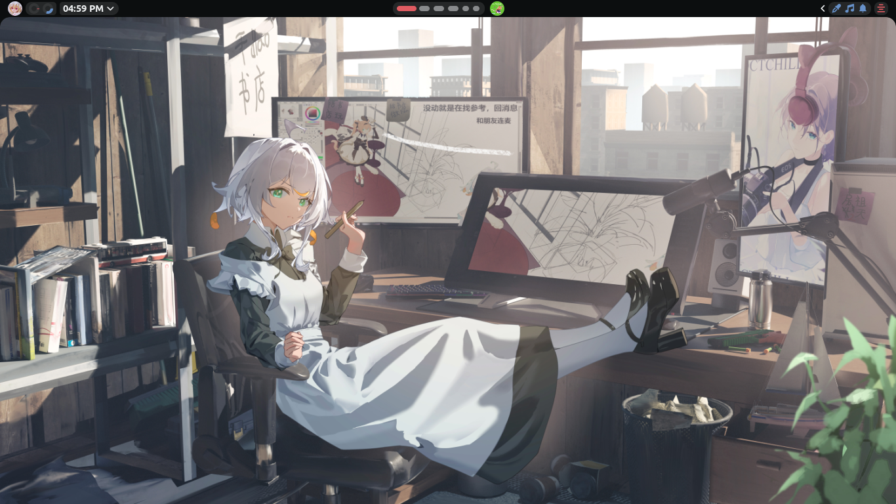
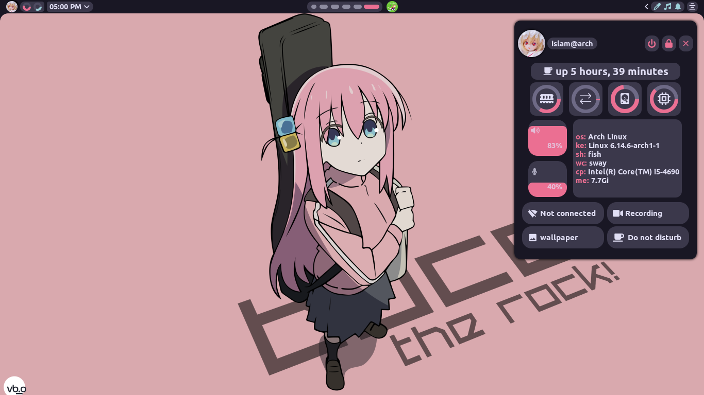
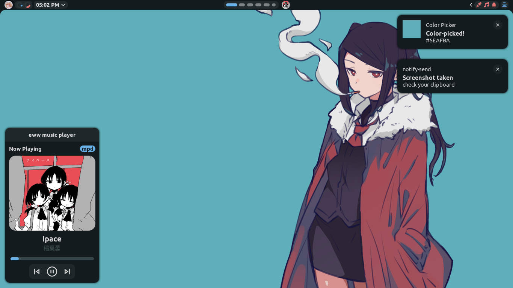

    <h1>Dotfiles</h1>

>   [!Caution]
>   I made these dotfiles for myself in the way i like, I WOULD NOT SUGGEST YOU TO USE THEM

# crystals

|  |  |
|---------------------------------|-----------------------------------|
|  |  |

# what i use

- Arch linux `distro`
- swayfx, gtkclok `window manager, lock screen`
- eww `bar, notifications, powermenu, wallpaper, sysinfo, widgets`
- wofi `app launcher ; scripts`
- foot `term`
- eww, wofi `background changer`
- neovim `text editor`
- grim and slurp `screen shot`
- fish `shell`

### dependencies

- ubuntu nerd font
- python dbus
- pamixer
- playerctl
- mpd-mpris

# To Do

- [ ] more bloat
